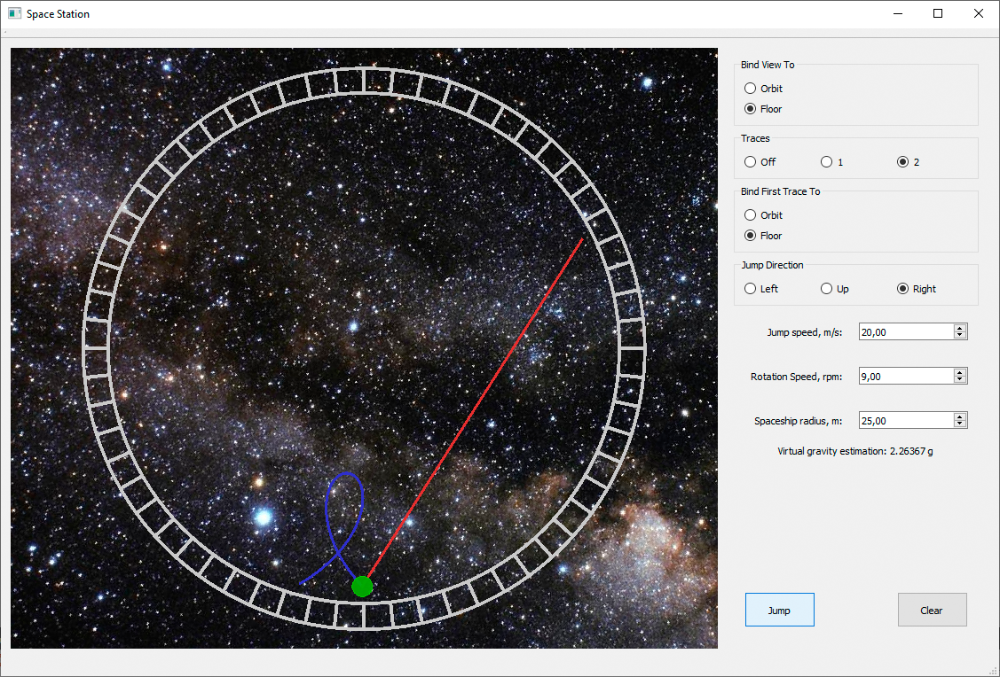

# SpaceStation
Artificial gravity simulator

QT-based project developed to demonstrate imaginary oddities of jumping or throwing objects onboard a rotating space station.

Describing video in russian:
https://youtu.be/H_5Eg96iELQ

